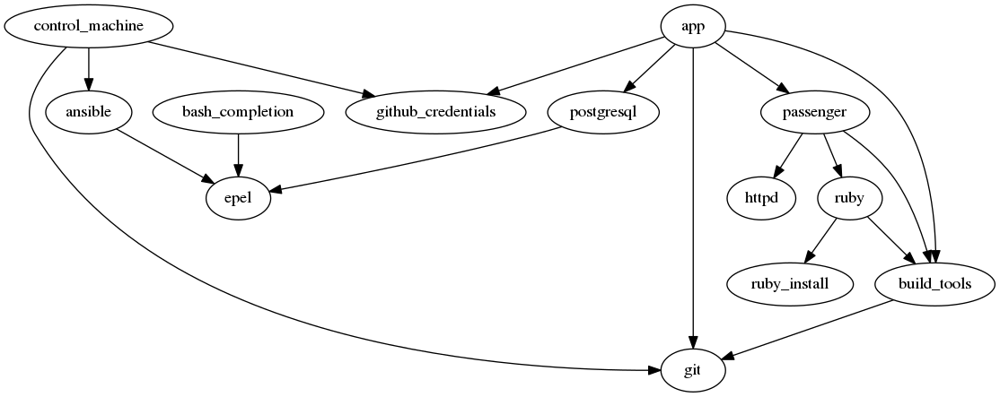

# ansible-roles-graph

Generate a graph of Ansible role dependencies.

## Install

    pip install ansible-roles-graph

Assuming you already installed [graphviz](http://www.graphviz.org/)
with [python bindings](http://www.graphviz.org/content/python-graphviz).

## Usage

Quite simply:

    ansible-roles-graph

Will look for roles in the `./roles/` directory, and generate an `./ansible-roles.png` file.

The command also accepts multiple role directories and various options:

    ansible-roles-graph -o schema.png -f png roles/ ../other/roles

See `ansible-roles-graph --help` for more info.

## Output

## License

[GNU GPLv3 or later](https://www.gnu.org/licenses/gpl.html)
